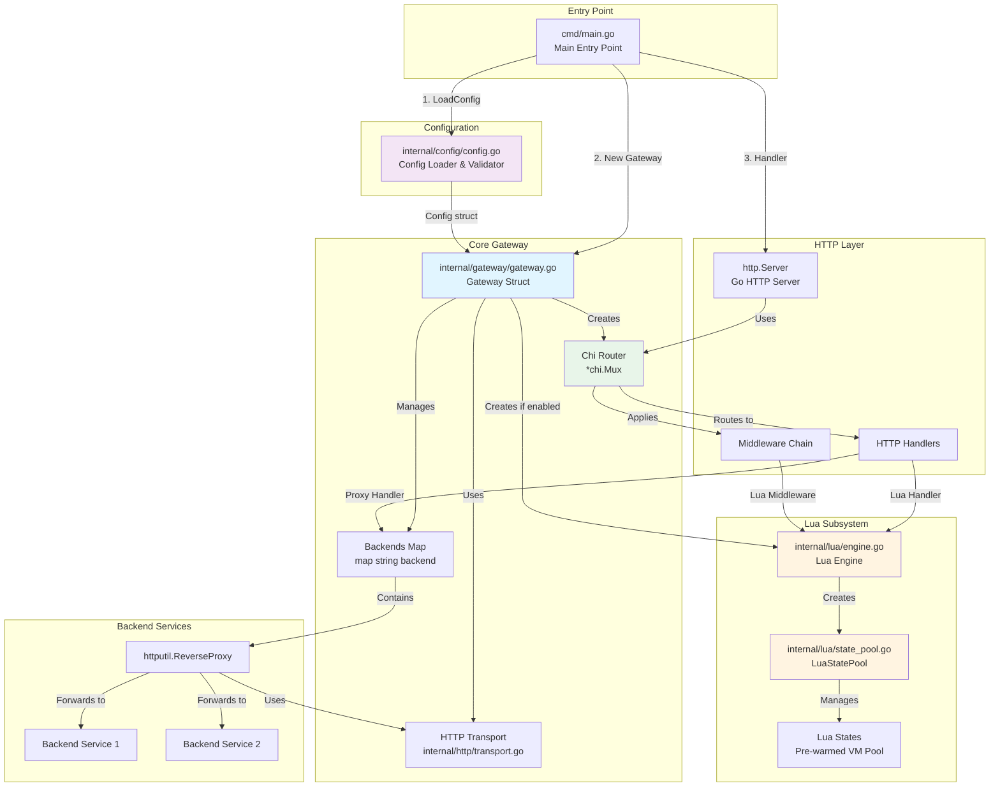
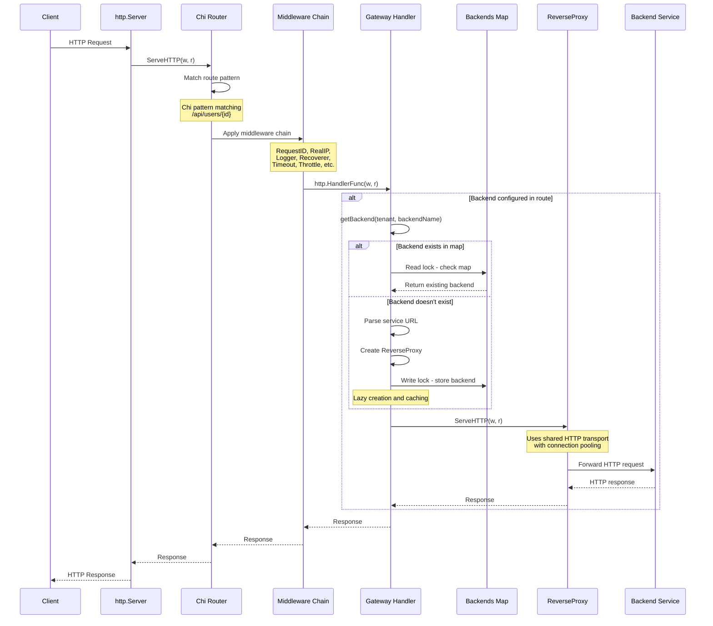
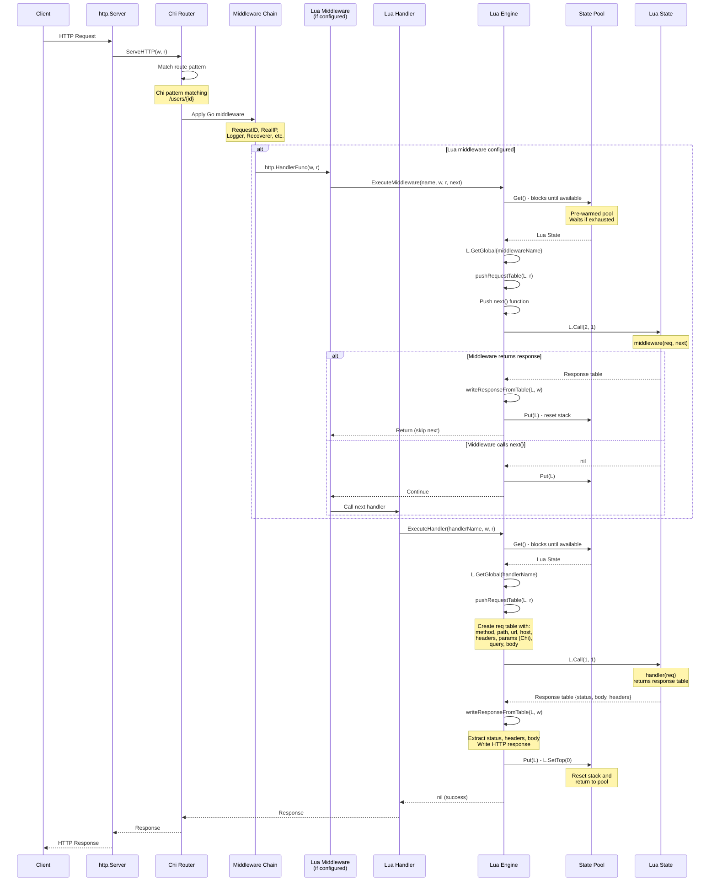

# Keystone Gateway - Technical Design

**Purpose:** This document describes the technical architecture and implementation details of Keystone Gateway.

For philosophy and principles, see [MANIFEST.md](MANIFEST.md).
For evolution history, see [ROADMAP.md](ROADMAP.md).

---

## Table of Contents

1. [System Architecture & Flow](#system-architecture--flow)
2. [Module Design](#module-design)
3. [Design Decisions & Rationale](#design-decisions--rationale)
4. [Design Decisions Record](#design-decisions-record)
5. [Current State](#current-state)
6. [Version History](#version-history)

---

## System Architecture & Flow

This section provides a concrete, system-level view of Keystone Gateway's architecture, detailing the components, their interactions, and the end-to-end flow of a request.

### Component Architecture

The gateway is composed of several key Go packages that work together to handle requests. The following diagram illustrates the verified architecture based on actual code analysis:



**Key Architecture Details:**
- Gateway contains Chi router, backends map (with RWMutex), Lua engine (optional), and shared HTTP transport
- Lua engine owns the state pool which pre-warms a fixed number of Lua VMs
- Backends are lazily created on first use and cached in a thread-safe map
- All routing (both proxy and Lua) goes through the Chi router
- Middleware chain includes both Go middleware and optional Lua middleware

### Core Components

*   **`cmd/main.go`**: The application entrypoint. Parses command-line flags (like `-config`), loads configuration, and starts the HTTP server with the gateway.

*   **`internal/config`**: Defines the configuration structure (`config.go`) that maps directly to `config.yaml`. The `Tenant` is the core concept, linking path prefixes to routes (Lua handlers or backend proxies).

*   **`internal/gateway`**: The core gateway implementation (`gateway.go`). Creates the Chi router, initializes the Lua engine (if enabled), sets up routes from configuration, and handles both Lua and proxy routing. This is the main module that orchestrates everything.

*   **`internal/lua`**: The Lua scripting engine with key components:
    *   **`engine.go`**: Public API for executing Lua handlers and middleware. Manages state pool coordination and script loading.
    *   **`state_pool.go`**: Manages a pool of `lua.LState` virtual machines for thread safety and performance. Tracks metrics (hits, misses, wait time).
    *   **`cgo_luajit.go`**: Restores `pcall`/`xpcall` for LuaRocks compatibility (workaround for golua library)

### Request Flow: End-to-End

An incoming HTTP request is handled by the single, master `chi` router. The path it takes depends on whether it matches a static or a dynamic (Lua-defined) route.

#### Scenario 1: Static Route

A request is mapped to a pre-configured, static backend service.

1.  A request arrives at the `http.Server`.
2.  The server passes it to the master `chi` router in the `Gateway`.
3.  `chi` matches the request's path to a static route defined in the `config.yaml` (a route with `backend` specified).
4.  The `routing.Gateway`'s handler takes over.
5.  It looks up the backend service for that tenant.
6.  It uses `httputil.ReverseProxy` to forward the request.
7.  The response from the upstream service is streamed back to the client.



**Key Details:**
- All requests go through Chi router (unified routing)
- Middleware applied before handler execution
- Backends lazy-loaded and cached in map with RWMutex
- ReverseProxy uses shared HTTP transport with connection pooling

#### Scenario 2: Dynamic (Lua) Route

A request is handled by a custom Lua script.

1.  A request arrives at the `http.Server`.
2.  The server passes it to the master `chi` router.
3.  `chi` matches the request to a route defined in the YAML configuration that maps to a Lua handler function.
4.  The Go handler created by the gateway for that route is executed.
5.  The handler acquires a `lua.LState` from the `state_pool`.
6.  It constructs a Lua request table with all request data (method, path, headers, params, query, body).
7.  It pushes the request table onto the Lua stack and calls the handler function.
8.  The Lua handler function executes. It can:
    *   Read request data from the table: `req.method`, `req.headers["Authorization"]`, `req.params.id`, `req.body`
    *   Make outbound HTTP calls using Go primitives: `http_get()`, `http_post()`
    *   Log messages using `log()`
    *   Return a response table: `{status = 200, body = "...", headers = {...}}`
9.  The handler parses the returned response table and writes the HTTP response.
10. The `LState` is returned to the pool.
11. The HTTP response is sent back to the client.



**Key Details:**
- Lua routes also go through Chi router (same path as proxy routes)
- State pool blocks when exhausted (doesn't create new states dynamically)
- Request table includes Chi route params via chi.RouteContext
- Lua middleware can short-circuit by returning response or call next() to continue
- States are reset (L.SetTop(0)) before returning to pool
- Middleware chains: Go middleware → Lua middleware (if configured) → Lua handler

### Scalability and Performance

The gateway is designed for high performance and scalability, primarily through these mechanisms:

*   **Lua Bytecode Caching**: Lua scripts are compiled to bytecode once at startup, not interpreted on every request. This significantly reduces processing overhead.
*   **Lua State Pooling**: `lua.LState` instances are expensive to create. By maintaining a pool of pre-initialized states, the gateway avoids this cost on the hot path, dramatically increasing throughput for dynamic routes.
*   **Efficient Static Proxying**: For static routes, the gateway uses Go's highly optimized `httputil.ReverseProxy`, which is a battle-tested, high-performance solution for HTTP forwarding.
*   **Connection Pooling**: The underlying Go HTTP clients (both for the reverse proxy and the Lua HTTP client) use connection pooling to reuse TCP connections to backend services, reducing latency.
*   **Stateless Core**: The gateway core itself is stateless. It doesn't manage sessions or tokens, making it easy to scale horizontally. State management is the responsibility of tenants (in Lua scripts) or external services.

---

## Module Design

### 1. Lua Engine (Deep Module)

**Interface (Simple):**
```go
type Engine interface {
    ExecuteRouteScript(scriptTag string) error
    ExecuteGlobalScripts() error
    ReloadScripts()
}
```

**Hidden Complexity:**
- Lua state pooling for thread safety
- Bytecode compilation and caching
- Script file discovery and loading
- Error handling and recovery
- Memory management

**Design Decision:** Users shouldn't know states exist, bytecode exists, or pools exist. They just execute scripts.

---

### 2. Request/Response Tables (Simple Interface)

**Lua receives request as table:**
```lua
req = {
    method = "GET",                    -- HTTP method
    path = "/users/123",               -- URL path
    url = "http://...",                -- Full URL
    host = "example.com",              -- Host header
    remote_addr = "192.168.1.1:12345", -- Client IP
    headers = {...},                   -- HTTP headers map
    params = {id = "123"},             -- Chi URL parameters
    query = {foo = "bar"},             -- Query parameters
    body = "..."                       -- Request body (cached)
}
```

**Lua returns response as table:**
```lua
function handler(req)
    return {
        status = 200,
        body = "Hello, " .. req.params.id,
        headers = {["Content-Type"] = "text/plain"}
    }
end
```

**Configuration in YAML:**
```yaml
routes:
  - method: "GET"
    pattern: "/users/{id}"
    handler: "handler"
```

**Hidden Complexity:**
- Request body is read once and cached automatically
- URL parameters extracted from Chi router context
- Query string parsing
- Header normalization
- Size limits enforcement (10MB default)
- Table construction optimized with RawSet operations

**Why this is deep:**
- **Simple interface**: Just Lua tables (native data structure)
- **Complex implementation**: Caching, parsing, context management, size limits
- **Information hiding**: User doesn't manage cache or know about Go internals

---

### 3. HTTP Client (Go Primitives)

**Interface (Simple):**
```lua
-- HTTP GET request
local resp, err = http_get("https://api.example.com/data")

-- HTTP POST request
local resp, err = http_post(
    "https://api.example.com/users",
    '{"name":"John"}',
    {["Content-Type"] = "application/json"}
)
```

**Response structure:**
```lua
resp = {
    status = 200,
    body = "...",
    headers = {["Content-Type"] = "application/json"}
}
```

**Hidden Complexity:**
- HTTP/2 support with automatic fallback
- Connection pooling (100 max, 10 per host)
- Timeout management (10s default)
- TLS configuration
- Redirect handling
- Keep-alive optimization
- Error handling and recovery

**Why this is deep:**
- **Simple interface**: 4 methods with obvious signatures
- **Complex implementation**: Connection management, HTTP/2, pooling, TLS
- **Information hiding**: User doesn't configure pools or manage connections

---

### 4. Gateway Routing (Stateless Design)

**Interface (Deep Module):**
```go
type Gateway struct {}

func NewGateway(cfg *Config, router *chi.Mux) *Gateway
func (gw *Gateway) SetupRoutes()
func (gw *Gateway) Handler() http.Handler
func (gw *Gateway) Stop()
```

**Design Philosophy:**
The Gateway is intentionally stateless and delegates infrastructure concerns to external systems:

- **No health checking**: Health checks are performed by external load balancers (HAProxy, Nginx, AWS ELB, K8s Ingress)
- **No load balancing**: Each tenant routes to a single backend URL (which can be a load balancer)
- **Stateless operation**: No backend state tracking, connection pooling managed by stdlib

**Complexity (Hidden):**
- Path-based routing with Chi
- Reverse proxy configuration
- Transport optimization

**Why This Design:**
✅ **Gateway is dumb**: Infrastructure concerns handled externally
✅ **Horizontally scalable**: No state to synchronize
✅ **Cloud-native**: Leverages platform load balancing
✅ **Simple**: Fewer moving parts, less to break

---

### 5. Configuration (Shallow by Design)

**Interface:**
```go
type Config struct {
    Tenants       []Tenant
    Server        ServerConfig  // Empty struct, placeholder for future
    LuaRouting    LuaRoutingConfig
    Compression   CompressionConfig
    RequestLimits RequestLimitsConfig
}

func LoadConfig(path string) (*Config, error)
```

**Defaults Applied Automatically:**
- Compression.Level: 5 (balanced)
- Compression.ContentTypes: 6 common MIME types
- RequestLimits.MaxBodySize: 10MB
- All defaults applied via `UnmarshalYAML` (impossible to create Config without defaults)

**Why shallow is OK here:**
- Configuration is inherently structural (not algorithmic)
- YAML maps directly to structs
- Validation is separate concern (not in Config struct)
- Users NEED to see the structure

**Design Decision:** Configuration should be transparent, not opaque. Shallow is correct.

---

## Design Decisions & Rationale

### Decision 1: Lua for Routing Logic

**Why Lua?**
- ✅ **No recompilation**: Change routes without rebuilding
- ✅ **Embeddable**: Single binary deployment
- ✅ **Fast**: LuaJIT performance (not used yet, but available)
- ✅ **Simple**: Easy for ops teams to understand
- ✅ **Sandboxable**: Can restrict dangerous operations

**Alternatives considered:**
- JavaScript (V8): Heavier, harder to embed
- Python: Too heavy, not embeddable
- YAML DSL: Not Turing-complete, limited
- Go plugins: Fragile, version-dependent

**Rationale:** Lua hits the sweet spot of simplicity, embeddability, and power.

---

### Decision 2: Table-Based Lua API

**Why table-based?**
- ✅ **Simple**: Native Lua data structures (tables)
- ✅ **Predictable**: Clear input/output contract
- ✅ **Fast**: Optimized table construction with RawSet operations
- ✅ **Discoverable**: `req.method`, `req.headers`, `req.body` - obvious field names

**How it works:**
- Gateway constructs request table from HTTP request
- Pushes table to Lua stack
- Calls Lua handler function
- Handler returns response table
- Gateway parses response table and writes HTTP response

**Rationale:** Tables are the natural Lua idiom. Simple, fast, and predictable.

---

### Decision 3: Chi Router, Not Custom

**Why Chi?**
- ✅ **Mature**: Battle-tested in production
- ✅ **Composable**: Middleware, groups, mounting work naturally
- ✅ **Fast**: Built on http.ServeMux, minimal overhead
- ✅ **Standard**: Uses stdlib net/http interfaces

**Alternatives considered:**
- Gorilla Mux: Heavier, more features we don't need
- httprouter: Faster but less composable
- Custom router: Reinventing the wheel

**Rationale:** Chi provides exactly what we need, nothing more. Perfect fit for "general-purpose" philosophy.

---

### Decision 4: State Pooling, Not Per-Request States

**Why pool?**
- ✅ **Thread-safe**: Each goroutine gets isolated state
- ✅ **Performance**: Reuse states instead of creating/destroying
- ✅ **Memory efficient**: Fixed pool size prevents unbounded growth

**How it works:**
```go
// Get state from pool
L := pool.Get()
defer pool.Put(L)

// Use state (isolated from other requests)
L.CallByParam(...)
```

**Rationale:** Lua states are expensive to create. Pooling is the standard pattern for Lua embedding.

---

### Decision 5: Bytecode Compilation and Caching

**Why compile to bytecode?**
- ✅ **Performance**: 50-70% memory reduction (gopher-lua docs)
- ✅ **Startup speed**: Compile once, execute many times
- ✅ **Cache-friendly**: Bytecode is shared across all states

**How it works:**
```go
// Compile once
proto := lua.Compile(chunk, scriptName)

// Execute many times
L.Push(L.NewFunctionFromProto(proto))
L.PCall(0, lua.MultRet, nil)
```

**Rationale:** Pay compilation cost once, not on every request. Standard optimization for Lua.

---

### Decision 6: No OAuth/Auth in Gateway Core

**Why NOT include OAuth?**
- ✅ **Separation of concerns**: Gateway routes, tenants authenticate
- ✅ **Flexibility**: Tenants choose their own auth (OAuth, mTLS, API keys, custom)
- ✅ **Stateless**: Gateway doesn't manage tokens, sessions, etc.
- ✅ **General-purpose**: Auth is a specific use case, not a primitive

**How tenants handle auth:**
```lua
-- Tenant's own OAuth module (their code, not gateway's)
local OAuth = require("oauth_proxy")

function oauth_middleware(req, next)
    if not OAuth.validate(req) then
        return {status = 401, body = "Unauthorized"}
    end
    next()
    return nil
end

-- In config.yaml:
routes:
  - method: "POST"
    pattern: "/api/data"
    handler: "process_data"
    middleware:
      - "oauth_middleware"
```

**Rationale:** Gateway provides HTTP primitives. Tenants compose them into auth solutions.

---

### Decision 7: Configuration in YAML, Not Code

**Why YAML?**
- ✅ **Declarative**: What to route, not how to route
- ✅ **Familiar**: Ops teams understand YAML
- ✅ **Validatable**: Schema validation possible
- ✅ **Diffable**: Version control friendly

**Example:**
```yaml
lua_routing:
  enabled: true
  scripts_dir: "./scripts"
  global_scripts:
    - "handlers"

tenants:
  - name: "api"
    path_prefix: "/api"
    routes:
      - method: "GET"
        pattern: "/users/{id}"
        handler: "get_user"
      - method: "GET"
        pattern: "/legacy/*"
        backend: "backend"
    services:
      - name: "backend"
        url: "http://backend:3000"
```

**Alternatives considered:**
- HCL (Terraform-style): Less familiar
- JSON: Less human-friendly
- Go code: Requires recompilation

**Rationale:** YAML is the right level of abstraction for configuration.

---

## Design Decisions Record

This section documents major architectural decisions and their rationale.

### Decision: Remove Host-Based Routing (HostRouter) (Dec 2025)

**Context:**
The gateway supported both path-based routing (via Chi router) and host-based routing (via `hostrouter` library). This dual routing system created complexity:
- `Handler()` method returned either `gw.router` OR `gw.hostRouter` depending on tenant config
- Lua routes registered only on `gw.router`, becoming unreachable when host-based routing was enabled
- Two different routing mechanisms that behaved differently
- Unclear mental model for users

**Decision:**
Remove `hostrouter` dependency entirely. Gateway now uses **path-based routing only**. Domain-based routing should be handled by external reverse proxies, ingress controllers, or load balancers.

**Rationale:**
1. **"Gateway is dumb" principle**: Domain routing is infrastructure, not a gateway primitive
2. **Simpler mental model**: One router (`chi.Mux`), one routing mechanism
3. **Aligns with health check removal**: Both delegate infrastructure concerns to infrastructure layer
4. **Fixes Lua route bug**: Lua routes now always work since there's only one router
5. **Cloud-native pattern**: Ingress controllers and reverse proxies are designed for domain routing
6. **Consistent with design philosophy**: Gateway provides HTTP primitives, infrastructure provides routing

**Implementation:**
- Removed `hostRouter hostrouter.Routes` field from Gateway struct
- Removed `import "github.com/go-chi/hostrouter"`
- Removed `Domains []string` field from Tenant config
- Simplified `Handler()` to always return `gw.router`
- Removed domain validation logic (`isValidDomain()` function)
- Updated `setupSingleTenantRoutes()` to only handle path-based routing
- Updated tenant validation: `PathPrefix` is now optional (defaults to catch-all `/*` if not specified)
- Updated tests to use path-based routing

**Migration Path:**
Users who relied on domain-based routing should configure external reverse proxy (Nginx, HAProxy, K8s Ingress) to route domains to path prefixes on the gateway.

See [ROADMAP.md](ROADMAP.md#v500-december-2025---path-only-routing) for migration examples.

**Trade-offs:**
- ✅ **Gains**: Simpler architecture, Lua routes always work, clearer mental model
- ⚠️ **Loses**: Built-in domain-based routing
- **Verdict**: Simplification and architectural clarity outweigh the convenience of built-in domain routing

This is a **breaking change** requiring a major version bump (v5.0.0).

---

### Decision: Delegate Health Checking to External Infrastructure (Dec 2025)

**Context:**
The gateway previously included built-in health checking and automatic backend failover. This added complexity and state management to the core routing logic.

**Decision:**
Remove health checking from the gateway entirely. Delegate this responsibility to external load balancers (HAProxy, Nginx, AWS ELB, K8s Ingress, etc.).

**Rationale:**
1. **Stateless is simpler**: No backend state to track, no health check workers to manage
2. **Cloud-native alignment**: Modern platforms provide superior load balancing with health checks
3. **"Gateway is dumb" principle**: Infrastructure concerns belong in infrastructure layer
4. **Horizontal scalability**: No state synchronization needed across gateway instances
5. **Single responsibility**: Gateway focuses purely on HTTP routing and Lua scripting

**Implementation:**
- Each tenant now routes to a single backend URL (which can be an external load balancer)
- Removed `Backend.Healthy` field and all health check orchestration code
- Simplified `/health` endpoint to basic liveness check (not backend health aggregation)
- Removed ~150 lines of health checking code from `internal/routing/gateway.go`
- Eliminated health check goroutines, context management, and state synchronization

**Migration Path:**
Users who relied on built-in health checking should:
1. **Recommended**: Use an external load balancer in front of backend services
   - HAProxy, Nginx, AWS ELB, K8s Ingress all provide robust health checking
   - Configure tenant backend URLs to point to the load balancer
2. **Alternative**: Implement custom health checking in Lua scripts if needed
3. **For development**: Use a simple reverse proxy like Nginx locally

See [ROADMAP.md](ROADMAP.md#v400-december-14-2025---stateless-revolution) for migration guide.

**Trade-offs:**
- ✅ **Gains**: Simpler code, stateless operation, better scalability, cloud-native alignment
- ⚠️ **Loses**: Built-in health checking for simple deployments without external LB
- **Verdict**: The simplification and cloud-native alignment outweigh the loss

This is a **breaking change** requiring a major version bump (v4.0.0).

---

## Current State

### What's Going Well

✅ **Host-Based Routing Removal** (Dec 2025) - Simplified routing architecture:
- Removed `hostrouter` dependency and `Domains` config field
- Simplified `Handler()` method to always return single router
- Fixed Lua route bug (routes now always reachable)
- Removed ~50 lines of domain routing code
- Clearer mental model: path-based routing only
- Aligns with "gateway is dumb" principle

✅ **Health Checking Removal** (Dec 2025) - Achieved stateless design:
- Removed ~150 lines of health checking code from Gateway
- Eliminated health check goroutines, state synchronization, context management
- Gateway is now fully stateless (no backend state tracking)
- Aligned with cloud-native infrastructure patterns
- Simplified constructor (single backend per tenant)

✅ **Lua Module Refactoring** (Dec 2025) - Successfully implemented table-based API:
- Simple interface: Lua handlers receive request tables, return response tables
- Request table contains: `method`, `path`, `url`, `host`, `remote_addr`, `headers`, `params`, `query`, `body`
- Response table contains: `status`, `body`, `headers`
- Go primitives: `log()`, `http_get()`, `http_post()` exposed as simple functions
- Reduced `chi_bindings.go` from 598 lines to ~50 lines (90% reduction)
- Lua API is now discoverable and natural (table-based: `req.method`, `req.headers["Authorization"]`, `req.body`)

✅ **Handlers Removal** (Dec 2025) - Simplified admin routes:
- Removed `internal/handlers/handlers.go` (71 lines of unnecessary abstraction)
- Moved health check endpoint directly into `application.go`
- Removed route group complexity
- More direct, easier to understand

✅ **Configuration Anti-Pattern Fixes** (Dec 2025) - Cleaned up config module:
- Removed 8+ dead fields (TLSConfig, AdminBasePath, Tenant.Interval, Service.Health, etc.)
- Fixed pass-through anti-pattern: lua.Engine no longer receives full Config, only maxBodySize it needs
- Moved defaults from ApplyDefaults() to UnmarshalYAML (impossible to create Config without defaults)
- Reduced coupling between config and lua packages
- Net reduction: -27 lines, cleaner codebase

✅ **Script Compilation** - Unified compiler cache:
- Single `ScriptCompiler` handles all Lua bytecode caching
- No duplicate compilation logic
- Proper memory management
- 50-70% memory reduction per gopher-lua docs

---

### Opportunities for Improvement

#### Consider Additional Cloud-Native Patterns
**Goal:** Continue simplifying by leveraging platform capabilities

**Potential areas:**
- Metrics export (delegate to sidecar pattern)
- Distributed tracing (use OpenTelemetry SDK, not custom implementation)
- TLS termination (can be handled by load balancer/ingress)

**Philosophy:** Keep evaluating what can be delegated to infrastructure vs. what must be in the gateway

---

## Version History

**For detailed version history with rationale and migration guides, see [ROADMAP.md](ROADMAP.md).**

- **v5.0.0** (Dec 2025): Path-only routing - Removed host-based routing
- **v4.0.0** (Dec 2025): Stateless gateway - Removed health checking
- **v3.0.0** (Dec 2025): Deep modules refactoring - gopher-luar adoption
- **v2.0.0** (Sep 2025): Performance breakthrough - Bytecode compilation
- **v1.4.0** (Aug 2025): KISS/DRY refactoring
- **v1.2.0** (Jul 2025): Host-based routing added (later removed in v5.0.0)
- **v1.0.0** (Jul 2025): Initial release

---

## Appendix: Key Metrics

**Current codebase (as of Dec 2025):**
- Total lines: ~1,600 (excluding tests) - Down from ~3,500
- Lua engine: Table-based API (simple, fast, predictable)
- Core modules: 3 (gateway, lua, config)
- External dependencies: 3 (Chi, golua, yaml)

**Achievements (Dec 2025 refactoring):**
- ✅ Lua API: Table-based interface (request table in, response table out)
- ✅ Go primitives: `log()`, `http_get()`, `http_post()` exposed to Lua
- ✅ Handlers package removed (71 lines)
- ✅ lua_routes.go removed (49 lines)
- ✅ Script compilation unified (single compiler cache)
- ✅ **Health checking removed** (~150 lines) - Gateway now stateless
- ✅ **Host routing removed** (~50 lines) - Path-only routing
- ✅ Gateway constructor simplified (single constructor pattern)
- ✅ Total code reduction: ~1,900 lines removed (3,500 → 1,600)

**Code quality metrics:**
- Functions >50 lines: 2 (down from 3)
- Empty files: 0 ✅ (down from 3)
- Pass-through parameters: 0 ✅ (eliminated)

---

**This design document is a living document. Update it when:**
- Core architectural decisions change
- New modules are added
- Major refactoring occurs

For philosophy and principles, see [MANIFEST.md](MANIFEST.md).
For evolution history, see [ROADMAP.md](ROADMAP.md).

**Last updated:** December 2025 (v5.0.0)
