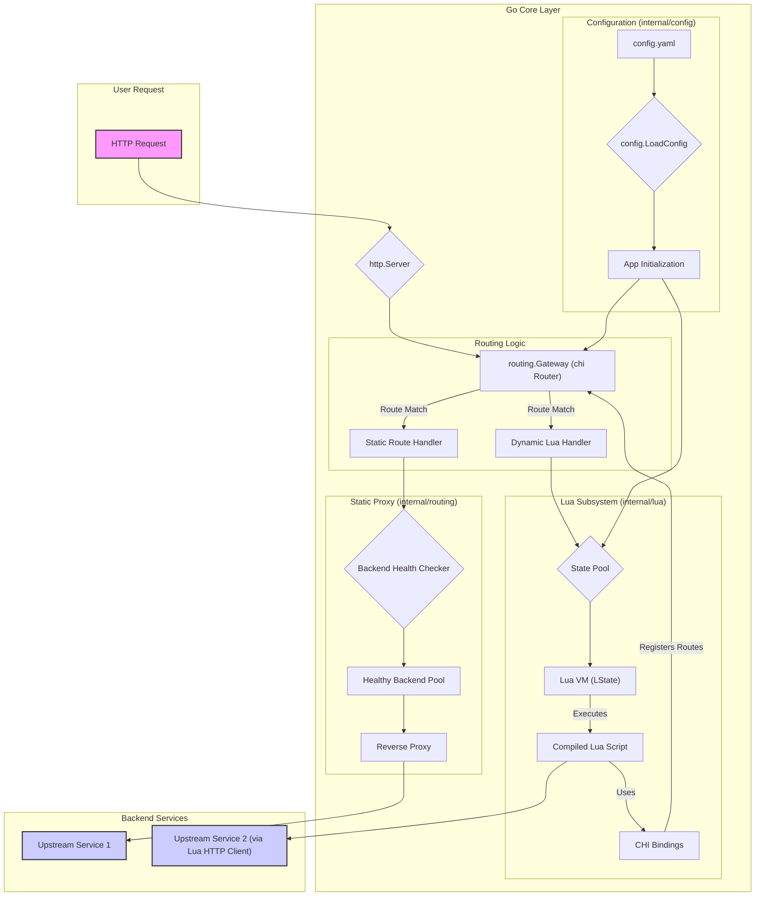
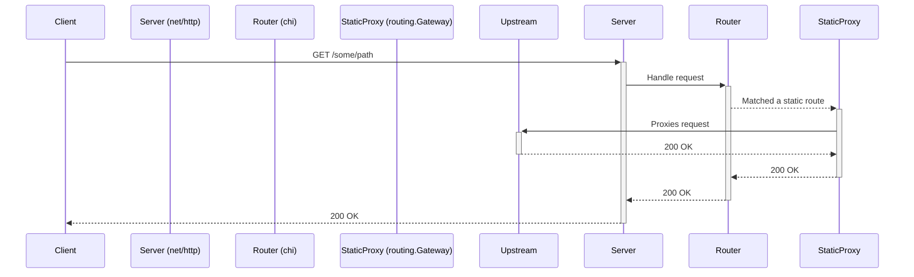
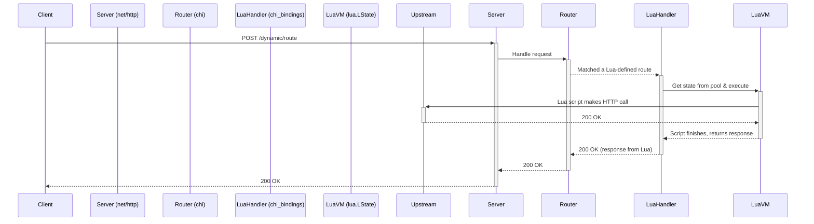

# Keystone Gateway - Design Document

**Version:** 2.0  
**Date:** December 2024  
**Author:** Daniel Kremer  
**Philosophy:** Based on "A Philosophy of Software Design" by John Ousterhout

---

## Table of Contents

1. [Vision & Principles](#vision--principles)
2. [Core Philosophy](#core-philosophy)
3. [Architecture Overview](#architecture-overview)
4. [Module Design](#module-design)
5. [Design Decisions & Rationale](#design-decisions--rationale)
6. [Anti-Patterns to Avoid](#anti-patterns-to-avoid)
7. [Development Guidelines](#development-guidelines)
8. [Future Evolution](#future-evolution)

---

## Vision & Principles

### What Keystone Gateway IS

**A general-purpose HTTP routing primitive with embedded Lua scripting.**

Keystone Gateway is a high-performance reverse proxy that provides:
- Multi-tenant HTTP routing (by domain, path, or both)
- Embedded Lua scripting for route definition
- Load balancing across backend services
- Health checking and automatic failover

### What Keystone Gateway IS NOT

- ❌ An API gateway with opinions (auth, rate limiting, etc.)
- ❌ An OAuth provider or authentication system
- ❌ A service mesh or distributed system
- ❌ A configuration management system
- ❌ A specialized tool for one use case

### Core Design Principle

> **The gateway is dumb. Tenants are smart.**

The gateway provides **powerful, general-purpose primitives**. Tenants compose these primitives into specific solutions for their needs.

---

## Core Philosophy

### 1. Complexity is the Enemy

**From the book (Chapter 2):**
> "Complexity is anything related to the structure of a software system that makes it hard to understand and modify the system."

**Our application:**
- Minimize the number of concepts a developer must understand
- Hide complexity inside deep modules
- Keep interfaces simple and obvious

### 2. Deep Modules

**From the book (Chapter 4):**
> "The best modules are those whose interfaces are much simpler than their implementations."

**Deep modules in Keystone:**
```
┌─────────────────────────────────────┐
│      Simple Interface (small)        │
├─────────────────────────────────────┤
│                                      │
│                                      │
│    Complex Implementation (large)    │
│                                      │
│                                      │
└─────────────────────────────────────┘
```

**Examples:**
- **Lua Engine**: Simple API (`ExecuteRouteScript`), complex internals (state pooling, bytecode compilation, caching)
- **HTTP Client**: Simple API (`Get`, `Post`), complex internals (connection pooling, HTTP/2, timeouts)
- **Request Wrapper**: Simple property access (`req.Method`), complex internals (caching, parsing, validation)

### 3. Information Hiding

**From the book (Chapter 5):**
> "Each module should encapsulate a few pieces of knowledge, which represent design decisions."

**What we hide:**
- Lua state pool implementation
- Bytecode compilation strategy
- HTTP connection pooling details
- Health check scheduling
- Request body caching mechanism

**What we expose:**
- Simple route registration
- Request/response properties
- HTTP client methods
- Configuration structure

### 4. Pull Complexity Downward

**From the book (Chapter 8):**
> "It is more important for a module to have a simple interface than a simple implementation."

**Application:**
- Complex logic belongs in **Go**, not **Lua scripts**
- Request body caching: automatic, not manual
- State management: hidden in pools, not exposed to users
- Error handling: define errors out of existence where possible

### 5. General-Purpose Modules

**From the book (Chapter 6):**
> "A somewhat general-purpose approach can be simpler than a special-purpose approach."

**Application:**
- HTTP client works for ANY HTTP request (not specialized for OAuth, REST, etc.)
- Request wrapper works for ANY request type
- Routing works for ANY tenant configuration
- No special cases baked into core

---

## System Architecture & Flow

This section provides a concrete, system-level view of Keystone Gateway's architecture. It details the components, their interactions, and the end-to-end flow of a request.

### Component Architecture

The gateway is composed of several key Go packages that work together to handle requests. The following diagram illustrates the high-level architecture and data flow:



### Core Components

*   **`cmd/main`**: The application entrypoint. It parses command-line flags (like `-config`), loads the configuration, initializes the main `app.Application`, and starts the HTTP server.

*   **`internal/config`**: Defines the configuration structure (`config.go`) that maps directly to the `config.yaml`. It's responsible for loading and parsing this file. The `Tenant` is the core concept, linking domains/paths to either static backends or Lua scripts.

*   **`internal/app`**: The central coordinator. `application.go` wires everything together. It creates the master `chi` router, initializes the Lua engine, and sets up the static routing gateway. It orchestrates the startup sequence, ensuring Lua routes are registered before the static routes.

*   **`internal/routing`**: Manages static, proxy-based routing. The `Gateway` (`gateway.go`) sets up `httputil.ReverseProxy` handlers for tenants configured with backend `services`. **Note:** Health checking logic is currently embedded here but should be extracted to a separate module (see **Current Technical Debt** section).

*   **`internal/lua`**: The dynamic scripting engine. This is a deep and powerful module with several key components:
    *   **`engine.go`**: The public API for the Lua subsystem. It manages script execution and state pool coordination.
    *   **`script_compiler.go`**: Pre-compiles Lua source code into bytecode to reduce execution latency. The bytecode is cached in memory for reuse across all Lua states.
    *   **`state_pool.go`**: Manages a pool of `lua.LState` virtual machines. This is a critical performance optimization, as creating Lua states is expensive. Reusing them across requests significantly improves throughput.
    *   **`chi_bindings.go`**: Reduced from 598 to ~50 lines via gopher-luar refactoring. Sets up the Lua environment with access to Chi router and deep modules.
    *   **`modules/`** directory (new in Dec 2025 refactoring):
        *   **`request.go`**: Deep Request module - Simple interface (properties + methods), complex caching and context management
        *   **`response.go`**: Deep Response module - HTTP response writing with proper headers
        *   **`http.go`**: Deep HTTP client module - Connection pooling, HTTP/2, timeout management

### Request Flow: End-to-End

An incoming HTTP request is handled by the single, master `chi` router. The path it takes depends on whether it matches a static or a dynamic (Lua-defined) route.

#### Scenario 1: Static Route

A request is mapped to a pre-configured, static backend service.

1.  A request arrives at the `http.Server`.
2.  The server passes it to the master `chi` router in `routing.Gateway`.
3.  `chi` matches the request's host and path to a static route defined in the `config.yaml` (e.g., a `services` block for a `Tenant`).
4.  The `routing.Gateway`'s handler takes over.
5.  It looks up the healthy backend services for that tenant.
6.  It selects a backend and uses `httputil.ReverseProxy` to forward the request.
7.  The response from the upstream service is streamed back to the client.



#### Scenario 2: Dynamic (Lua) Route

A request is handled by a custom Lua script.

1.  A request arrives at the `http.Server`.
2.  The server passes it to the master `chi` router.
3.  `chi` matches the request to a route that was dynamically registered by a Lua script during startup (via `chi_route`).
4.  The Go handler created by `chi_bindings` for that route is executed.
5.  The handler acquires a `lua.LState` from the `state_pool`.
6.  It populates the Lua environment with request data (headers, body, etc.).
7.  It executes the specific Lua function associated with the matched route.
8.  The Lua script runs. It can:
    *   Read the request details.
    *   Make its own outbound HTTP calls to other services using the Lua HTTP client.
    *   Manipulate data.
    *   Write a response directly.
9.  Once the script finishes, the `LState` is returned to the pool.
10. The response generated by the Lua script is sent back to the client.



### Scalability and Performance

The gateway is designed for high performance and scalability, primarily through these mechanisms:

*   **Lua Bytecode Caching**: Lua scripts are compiled to bytecode once at startup, not interpreted on every request. This significantly reduces processing overhead.
*   **Lua State Pooling**: `lua.LState` instances are expensive to create. By maintaining a pool of pre-initialized states, the gateway avoids this cost on the hot path, dramatically increasing throughput for dynamic routes.
*   **Efficient Static Proxying**: For static routes, the gateway uses Go's highly optimized `httputil.ReverseProxy`, which is a battle-tested, high-performance solution for HTTP forwarding.
*   **Connection Pooling**: The underlying Go HTTP clients (both for the reverse proxy and the Lua HTTP client) use connection pooling to reuse TCP connections to backend services, reducing latency.
*   **Stateless Core**: The gateway core itself is stateless. It doesn't manage sessions or tokens, making it easy to scale horizontally. State management is the responsibility of tenants (in Lua scripts) or external services.

---

## Module Design

### 1. Lua Engine (Deep Module)

**Interface (Simple):**
```go
type Engine interface {
    ExecuteRouteScript(scriptTag string) error
    ExecuteGlobalScripts() error
    ReloadScripts()
}
```

**Hidden Complexity:**
- Lua state pooling for thread safety
- Bytecode compilation and caching
- Script file discovery and loading
- Error handling and recovery
- Memory management

**Design Decision:** Users shouldn't know states exist, bytecode exists, or pools exist. They just execute scripts.

---

### 2. Request Wrapper (Deep Module)

**Interface (Simple):**
```go
type Request struct {
    // Properties (not methods)
    Method  string
    URL     string
    Path    string
    Host    string
}

// Methods for dynamic access
func (r *Request) Header(key string) string
func (r *Request) Query(key string) string
func (r *Request) Param(key string) string  // Chi URL params
func (r *Request) Body() string             // Auto-cached
func (r *Request) Headers() map[string]string
```

**Lua usage:**
```lua
chi_route("GET", "/users/{id}", function(req, res)
    local id = req:Param("id")              -- Clean, discoverable
    local auth = req:Header("Authorization")
    local body = req:Body()                 -- Cached automatically
    print(req.Method)                        -- Property access
end)
```

**Hidden Complexity:**
- Request body is read once and cached automatically
- URL parameters extracted from Chi router context
- Query string parsing
- Header normalization
- Size limits enforcement

**Why this is deep:**
- **Simple interface**: Just properties and a few methods
- **Complex implementation**: Caching, parsing, context management, size limits
- **Information hiding**: User doesn't manage cache or know about context

---

### 3. HTTP Client (Deep Module)

**Interface (Simple):**
```go
type HTTPClient struct {}

type HTTPResponse struct {
    Body    string
    Status  int
    Headers map[string]string
}

func (c *HTTPClient) Get(url string, headers map[string]string) *HTTPResponse
func (c *HTTPClient) Post(url, body string, headers map[string]string) *HTTPResponse
func (c *HTTPClient) Put(url, body string, headers map[string]string) *HTTPResponse
func (c *HTTPClient) Delete(url string, headers map[string]string) *HTTPResponse
```

**Lua usage:**
```lua
local resp = HTTP:Get("https://api.example.com/data", {
    Authorization = "Bearer " .. token
})

if resp.Status == 200 then
    res:Write(resp.Body)
end
```

**Hidden Complexity:**
- HTTP/2 support with automatic fallback
- Connection pooling (100 max, 10 per host)
- Timeout management (10s default)
- TLS configuration
- Redirect handling
- Keep-alive optimization
- Error handling and recovery

**Why this is deep:**
- **Simple interface**: 4 methods with obvious signatures
- **Complex implementation**: Connection management, HTTP/2, pooling, TLS
- **Information hiding**: User doesn't configure pools or manage connections

---

### 4. Gateway Routing (Currently Being Refactored)

**Current Interface (Needs Simplification):**
```go
type Gateway struct {}

func NewGateway(cfg *Config) *Gateway
func NewGatewayWithRouter(cfg *Config, router *chi.Mux) *Gateway  // Confusing - should remove
func (gw *Gateway) SetupRoutes()  // Shallow wrapper
func (gw *Gateway) Handler() http.Handler
func (gw *Gateway) Stop()
func (gw *Gateway) HasHealthyBackends() bool
func (gw *Gateway) GetConfig() *config.Config  // Information leakage?
```

**Current Complexity (Some Hidden, Some Leaked):**
- Host-based routing with hostrouter
- Path-based routing with Chi
- Hybrid routing (host + path)
- Backend pool management
- Round-robin load balancing
- Health check orchestration (mixed in - should be extracted)
- Graceful shutdown coordination

**Known Issues (See `internal/routing/gateway.go` comments):**
- ❌ **Health checking logic embedded** (lines 234-304) - violates single responsibility
- ❌ **Two constructors** create confusion about usage
- ❌ **Shallow wrappers** like `SetupRoutes()` add indirection without value
- ❌ **setupTenantRoutes()** does too much (line 99) - initialization, validation, routing setup
- ❌ **Information leakage** via `GetConfig()` - exposes internal config

**Goal State (Deep Module):**
```go
type Gateway struct {}

func NewGateway(cfg *Config, router *chi.Mux) *Gateway  // Single constructor
func (gw *Gateway) Handler() http.Handler
func (gw *Gateway) Stop()
```

**Path Forward:**
1. Extract health checking to `internal/healthcheck` module
2. Remove `NewGatewayWithRouter` - keep single constructor
3. Consolidate shallow wrappers
4. Remove `GetConfig()` - no information leakage

See **Current Technical Debt** and **Refactoring Roadmap** sections below.

---

### 5. Configuration (Shallow by Design)

**Interface:**
```go
type Config struct {
    Tenants       []Tenant
    AdminBasePath string
    Server        ServerConfig
    Compression   CompressionConfig
    RequestLimits RequestLimitsConfig
}

func LoadConfig(path string) (*Config, error)
```

**Why shallow is OK here:**
- Configuration is inherently structural (not algorithmic)
- YAML maps directly to structs
- Validation is separate concern (not in Config struct)
- Users NEED to see the structure

**Design Decision:** Configuration should be transparent, not opaque. Shallow is correct.

---

## Design Decisions & Rationale

### Decision 1: Lua for Routing Logic

**Why Lua?**
- ✅ **No recompilation**: Change routes without rebuilding
- ✅ **Embeddable**: Single binary deployment
- ✅ **Fast**: LuaJIT performance (not used yet, but available)
- ✅ **Simple**: Easy for ops teams to understand
- ✅ **Sandboxable**: Can restrict dangerous operations

**Alternatives considered:**
- JavaScript (V8): Heavier, harder to embed
- Python: Too heavy, not embeddable
- YAML DSL: Not Turing-complete, limited
- Go plugins: Fragile, version-dependent

**Rationale:** Lua hits the sweet spot of simplicity, embeddability, and power.

---

### Decision 2: gopher-luar for Lua Bindings

**Why gopher-luar?**
- ✅ **Eliminates glue code**: 500 lines → 50 lines
- ✅ **Automatic reflection**: Go structs → Lua tables
- ✅ **Discoverable API**: Methods callable from Lua naturally
- ✅ **Maintainable**: Less code = fewer bugs

**Cost:**
- ⚠️ **Reflection overhead**: Slight performance cost (acceptable for gateway use case)
- ⚠️ **Less control**: Automatic binding means less fine-tuning

**Rationale:** The massive reduction in code complexity outweighs minor performance cost. Gateway is I/O bound anyway.

---

### Decision 3: Chi Router, Not Custom

**Why Chi?**
- ✅ **Mature**: Battle-tested in production
- ✅ **Composable**: Middleware, groups, mounting work naturally
- ✅ **Fast**: Built on http.ServeMux, minimal overhead
- ✅ **Standard**: Uses stdlib net/http interfaces

**Alternatives considered:**
- Gorilla Mux: Heavier, more features we don't need
- httprouter: Faster but less composable
- Custom router: Reinventing the wheel

**Rationale:** Chi provides exactly what we need, nothing more. Perfect fit for "general-purpose" philosophy.

---

### Decision 4: State Pooling, Not Per-Request States

**Why pool?**
- ✅ **Thread-safe**: Each goroutine gets isolated state
- ✅ **Performance**: Reuse states instead of creating/destroying
- ✅ **Memory efficient**: Fixed pool size prevents unbounded growth

**How it works:**
```go
// Get state from pool
L := pool.Get()
defer pool.Put(L)

// Use state (isolated from other requests)
L.CallByParam(...)
```

**Rationale:** Lua states are expensive to create. Pooling is the standard pattern for Lua embedding.

---

### Decision 5: Bytecode Compilation and Caching

**Why compile to bytecode?**
- ✅ **Performance**: 50-70% memory reduction (gopher-lua docs)
- ✅ **Startup speed**: Compile once, execute many times
- ✅ **Cache-friendly**: Bytecode is shared across all states

**How it works:**
```go
// Compile once
proto := lua.Compile(chunk, scriptName)

// Execute many times
L.Push(L.NewFunctionFromProto(proto))
L.PCall(0, lua.MultRet, nil)
```

**Rationale:** Pay compilation cost once, not on every request. Standard optimization for Lua.

---

### Decision 6: No OAuth/Auth in Gateway Core

**Why NOT include OAuth?**
- ✅ **Separation of concerns**: Gateway routes, tenants authenticate
- ✅ **Flexibility**: Tenants choose their own auth (OAuth, mTLS, API keys, custom)
- ✅ **Stateless**: Gateway doesn't manage tokens, sessions, etc.
- ✅ **General-purpose**: Auth is a specific use case, not a primitive

**How tenants handle auth:**
```lua
-- Tenant's own OAuth module (their code, not gateway's)
local OAuth = require("oauth_proxy")

chi_middleware(function(req, res, next)
    if not OAuth.validate(req) then
        res:Status(401)
        return
    end
    next()
end)
```

**Rationale:** Gateway provides HTTP primitives. Tenants compose them into auth solutions.

---

### Decision 7: Configuration in YAML, Not Code

**Why YAML?**
- ✅ **Declarative**: What to route, not how to route
- ✅ **Familiar**: Ops teams understand YAML
- ✅ **Validatable**: Schema validation possible
- ✅ **Diffable**: Version control friendly

**Example:**
```yaml
tenants:
  - name: "api"
    domains: ["api.example.com"]
    lua_routes: "api-routes"
    services:
      - name: "backend"
        url: "http://backend:3000"
```

**Alternatives considered:**
- HCL (Terraform-style): Less familiar
- JSON: Less human-friendly
- Go code: Requires recompilation

**Rationale:** YAML is the right level of abstraction for configuration.

---

## Anti-Patterns to Avoid

### ❌ Shallow Modules (Too Many Small Functions)

**Bad (current chi_bindings.go):**
```go
L.SetGlobal("request_method", ...)      // 20 lines
L.SetGlobal("request_url", ...)         // 20 lines
L.SetGlobal("request_header", ...)      // 20 lines
L.SetGlobal("request_body", ...)        // 30 lines
// ... 20 more functions
```

**Good (with gopher-luar):**
```go
// One deep Request module
L.SetGlobal("Request", luar.NewType(L, Request{}))

// Usage in Lua:
// req.Method, req:Header("X-Foo"), req:Body()
```

**Why bad:** Each function requires type checking, error handling, Lua stack manipulation. 500 lines of boilerplate.

**Why good:** One module, many capabilities. 50 lines total with gopher-luar.

---

### ❌ Information Leakage

**Bad (OAuth in gateway core):**
```go
// Gateway knows about OAuth tokens
type OAuthConfig struct {
    TokenFile   string
    TokenFormat string  // Leaked implementation detail
    ExpiryBuffer int
}
```

**Good (OAuth in tenant code):**
```lua
-- Tenant's OAuth module uses gateway primitives
local OAuth = require("oauth_proxy")
local token = OAuth.get_token()  -- Implementation hidden

-- Gateway only provides HTTP client
local resp = HTTP:Get(url, {Authorization = "Bearer " .. token})
```

**Why bad:** Gateway is coupled to OAuth implementation details.

**Why good:** Gateway provides HTTP primitive, tenant composes auth logic.

---

### ❌ Pass-Through Variables

**Bad:**
```go
// cmd/main.go
cfg := config.LoadConfig(path)

// app/application.go
func New(cfg *config.Config) {
    engine := lua.NewEngine(cfg)  // Just passing through
}

// lua/engine.go  
func NewEngine(cfg *config.Config) {
    limits := cfg.RequestLimits  // Only needs this
}
```

**Good:**
```go
// cmd/main.go
cfg := config.LoadConfig(path)

// app/application.go
func New(cfg *config.Config) {
    engine := lua.NewEngine(cfg.RequestLimits)  // Pass what's needed
}

// lua/engine.go
func NewEngine(limits RequestLimits) {
    // Only depends on what it uses
}
```

**Why bad:** `cfg` travels through multiple layers unchanged. Creates coupling.

**Why good:** Each layer takes only what it needs. Reduces coupling.

---

### ❌ Classitis (Too Many Empty Files)

**Bad (current structure):**
```
internal/routing/
  ├── gateway.go           # 200 lines
  ├── circuit_breaker.go   # EMPTY
  ├── health_checker.go    # EMPTY
  └── load_balancer.go     # EMPTY
```

**Good:**
```
internal/routing/
  └── gateway.go  # 250 lines (everything consolidated)
```

**Why bad:** Empty files created "in anticipation" of features. Adds cognitive load.

**Why good:** Code lives where it's needed. Add files when they're actually needed.

---

### ❌ Temporal Decomposition

**Bad (splitting by when code runs):**
```go
// Phase 1 functions
func ParseConfig() {}
func ValidateConfig() {}

// Phase 2 functions
func SetupRouting() {}
func StartServer() {}

// Phase 3 functions
func HandleRequest() {}
```

**Good (splitting by knowledge/capability):**
```go
// Config module (encapsulates config knowledge)
type Config struct {}
func LoadConfig() {}
func (c *Config) Validate() {}

// Gateway module (encapsulates routing knowledge)
type Gateway struct {}
func NewGateway(cfg Config) {}
func (g *Gateway) Handler() http.Handler
```

**Why bad:** Groups code by execution order. Changes spread across multiple places.

**Why good:** Groups code by related knowledge. Changes are localized.

---

### ❌ Special Cases in Core

**Bad:**
```go
// Gateway knows about HTML, CSV, ZIP formats
if strings.Contains(url, "format=html") {
    // HTML redirect logic
} else if strings.Contains(url, "format=csv") {
    // CSV download logic
} else if strings.Contains(url, "zipexport") {
    // ZIP logic
}
```

**Good:**
```go
// Gateway provides general-purpose HTTP proxy
func (gw *Gateway) Proxy(w, r, targetURL) {
    // Standard HTTP proxying
}

// Tenant handles special cases in their code
// scripts/lua/data_transforms.lua (tenant's file)
local Transforms = require("transforms")
if url:match("format=html") then
    Transforms.redirect_to_html(req, res)
end
```

**Why bad:** Gateway is coupled to specific data formats. Not general-purpose.

**Why good:** Gateway stays general. Tenants add their own transforms.

---

## Current Technical Debt

This section documents known architectural debt and the plan to address it. This is normal in software evolution - the key is acknowledging it and having a path forward.

### Priority 1: Extract Health Checking from Gateway

**Problem:**
Health checking logic is embedded in `internal/routing/gateway.go` (lines 234-304). This violates the single responsibility principle - Gateway should route requests, not manage health checks.

**Current State:**
```go
// In Gateway struct (mixed concerns)
healthCtx  context.Context
healthStop context.CancelFunc
healthWG   sync.WaitGroup

// Health check methods in gateway.go
func (gw *Gateway) startHealthChecks()
func (gw *Gateway) healthCheckWorker(...)
func (gw *Gateway) checkBackendHealth(...)
```

**Solution:**
Create `internal/healthcheck` module:
```go
type HealthChecker interface {
    Start(backends []*Backend) error
    Stop()
    IsHealthy(backend *Backend) bool
    GetHealthyBackends(backends []*Backend) []*Backend
}
```

**Benefits:**
- Gateway focuses solely on routing (single responsibility)
- Health checking can be tested independently
- Can be reused for other health monitoring needs (databases, external APIs)
- Clear module boundaries

**Files to modify:**
- `internal/routing/gateway.go` - remove health check code (lines 234-304)
- `internal/healthcheck/checker.go` - new deep module
- `internal/app/application.go` - wire health checker to gateway

---

### Priority 2: Simplify Gateway Constructors

**Problem:**
Two constructors (`NewGateway` and `NewGatewayWithRouter`) create confusion about responsibilities and usage (gateway.go:42-72). Which one should I use? What's the difference?

**Current State:**
```go
func NewGateway(cfg *Config) *Gateway {
    // Creates own router internally - hidden dependency
    router := chi.NewRouter()
    ...
}

func NewGatewayWithRouter(cfg *Config, router *chi.Mux) *Gateway {
    // Takes router as parameter - explicit dependency
    ...
}
```

**Issue:**  Line 56 comment says: *"do we need these to sperate ones, this obfuscates the flow and responsiblilites of the module"*

**Solution:**
Keep only one constructor with explicit dependencies:
```go
func NewGateway(cfg *Config, router *chi.Mux) *Gateway {
    // Single, obvious way to create Gateway
    // Caller creates router if they need control
    ...
}
```

**Benefits:**
- Clear, single way to create Gateway (follows "obvious code" principle)
- Explicit dependencies (no hidden router creation)
- Less code to maintain
- No confusion about which constructor to use

**Files to modify:**
- `internal/routing/gateway.go` - remove `NewGateway`, keep only `NewGatewayWithRouter` (rename to `NewGateway`)
- `internal/app/application.go` - update to always create router first

---

### Priority 3: Consolidate Shallow Wrappers

**Problem:**
Functions like `SetupRoutes()` (line 75) just call `setupRoutes()` + `startHealthChecks()`. This is temporal decomposition (grouping by when code runs), not deep modules.

**Current State:**
```go
// Line 73 comment: "just a wrapper with helatch cheks, TOO SHALLOW"
func (gw *Gateway) SetupRoutes() {
    gw.setupRoutes()        // Private wrapper
    gw.startHealthChecks()  // Should be in separate module
}

// Line 79 comment: "just error wrapper for a fucntion that needs refactoring"
func (gw *Gateway) setupRoutes() {
    for _, tenant := range gw.config.Tenants {
        if err := gw.setupTenantRoutes(tenant); err != nil {
            // Error handling
        }
    }
}
```

**Solution:**
- Extract health checks to separate module (see Priority 1)
- Merge shallow wrappers into their callers
- OR make wrappers do meaningful work (validation, logging, recovery)

**Benefits:**
- Less code to navigate (fewer indirection layers)
- Clearer execution flow
- Follows deep module pattern

---

### What's Going Well

✅ **Lua Module Refactoring** - Successfully implemented deep modules:
- `internal/lua/modules/request.go` - Simple interface (properties + 5 methods), complex caching implementation
- `internal/lua/modules/response.go` - Simple HTTP response writing with proper content-type handling
- `internal/lua/modules/http.go` - Deep HTTP client with connection pooling, timeouts, HTTP/2
- Reduced `chi_bindings.go` from 598 lines to ~50 lines (90% reduction via gopher-luar)
- Lua API is now discoverable and natural (`req.Method`, `req:Header("X-Foo")`)

✅ **Handlers Removal** - Simplified admin routes:
- Removed `internal/handlers/handlers.go` (71 lines of unnecessary abstraction)
- Moved health check endpoint directly into `application.go`
- Removed route group complexity
- More direct, easier to understand

✅ **Script Compilation** - Unified compiler cache:
- Single `ScriptCompiler` handles all Lua bytecode caching
- No duplicate compilation logic
- Proper memory management
- 50-70% memory reduction per gopher-lua docs

---

## Refactoring Roadmap

### Completed ✅

#### Dec 2025: Lua Module Deep Refactoring
**Goal:** Eliminate glue code, create deep modules for Lua bindings

**Commit:** 287bc80 - "use gopher-luar for automatic type conversion and make lua modules DEEP"

**Changes:**
- Introduced gopher-luar for automatic Go ↔ Lua type conversion
- Created `internal/lua/modules/` directory with deep modules:
  - `request.go` - Request wrapper with caching, Chi URL params, context management
  - `response.go` - Response writer with proper headers and status codes
  - `http.go` - HTTP client with connection pooling and HTTP/2
- Reduced `chi_bindings.go` from 598 to ~50 lines (90% code reduction)
- Improved Lua API: Properties (`req.Method`) instead of getters (`req:GetMethod()`)

**Result:** DESIGN.md principle of "deep modules" achieved for Lua subsystem. This is a major win.

#### Dec 2025: Handlers Package Removal
**Goal:** Simplify application structure, remove unnecessary abstraction

**Commit:** caf29cc - "refactor(routing): remove unused handlers import and route group registration"

**Changes:**
- Removed `internal/handlers/handlers.go` (71 lines)
- Removed `internal/routing/lua_routes.go` (49 lines - logic moved to application.go)
- Moved simple health check directly into `application.go`
- Removed admin route group registration complexity

**Result:** Simpler, more direct code path. Easier to understand application flow.

---

### In Progress 🚧

#### Next: Health Check Extraction (Priority 1)
**Goal:** Separate health checking from Gateway routing

**Approach:**
1. Create `internal/healthcheck` module with clean interface
2. Define `HealthChecker` interface (Start, Stop, IsHealthy)
3. Move health check workers and state from `gateway.go`
4. Gateway becomes consumer of health check results (doesn't manage them)

**Files to create/modify:**
- `internal/healthcheck/checker.go` (new - ~200 lines from gateway.go)
- `internal/routing/gateway.go` (remove lines 35-39, 234-304)
- `internal/app/application.go` (wire health checker)

**Agent involvement** (per AGENTS.md):
- @architect: Review module boundaries and interface design
- @backend: Implement extraction carefully (no behavior change)
- @testing: Test health checker in isolation, integration tests
- @reviewer: Ensure no regressions, validate design compliance

**Success criteria:**
- [ ] Gateway has no health check code
- [ ] HealthChecker is a deep module (simple interface, complex implementation)
- [ ] All tests pass
- [ ] No behavior change (health checks work identically)

---

### Planned 📋

#### Future: Gateway Constructor Simplification (Priority 2)
**Goal:** Single, obvious way to create Gateway

**Approach:**
- Remove `NewGateway` (creates router internally)
- Keep `NewGatewayWithRouter`, rename to `NewGateway`
- Update all callers in `application.go`

**Files to modify:**
- `internal/routing/gateway.go` (remove one constructor)
- `internal/app/application.go` (always create router first)

**Estimated effort:** Small (1-2 hour change)

---

#### Future: Shallow Wrapper Consolidation (Priority 3)
**Goal:** Reduce indirection, improve code clarity

**Approach:**
- After health check extraction, merge `SetupRoutes()` into caller
- Evaluate each wrapper function - does it add value or just indirection?
- Keep wrappers that do meaningful work (validation, recovery, logging)

**Files to modify:**
- `internal/routing/gateway.go` (consolidate wrappers)

**Estimated effort:** Small (depends on health check extraction completion)

---

## Development Guidelines

### 1. When to Create a New Module

**Create a module when:**
- ✅ It encapsulates a distinct piece of knowledge (e.g., "how to manage Lua states")
- ✅ It can have a simple interface hiding complex implementation
- ✅ It's reusable across multiple parts of the codebase
- ✅ It has a clear, single responsibility

**Don't create a module when:**
- ❌ It's just one function (keep it in the parent module)
- ❌ It's empty or "planned for the future"
- ❌ It's only used in one place and tightly coupled to that place
- ❌ It's just grouping code by execution phase

**Example - Good module:**
```go
// internal/lua/compiler.go
// Clear responsibility: Compile Lua scripts to bytecode
type ScriptCompiler struct {
    cache map[string]*CompiledScript
}

func (c *ScriptCompiler) CompileScript(name, content string) (*CompiledScript, error)
func (c *ScriptCompiler) GetScript(name string) (*CompiledScript, bool)
```

---

### 2. Interface Design Checklist

Before exposing a function/method to Lua, ask:

- [ ] **Is this a primitive capability or business logic?**
  - Primitive → Gateway (e.g., HTTP request)
  - Business logic → Tenant (e.g., OAuth flow)

- [ ] **Can this be a property instead of a method?**
  - `req.Method` > `req:GetMethod()`
  - Properties are simpler and more discoverable

- [ ] **Does this leak implementation details?**
  - Bad: `GetTokenFromFile(path)` (leaks file storage)
  - Good: `GetToken()` (hides storage mechanism)

- [ ] **Is the interface minimal?**
  - Expose only what's necessary
  - Can't remove functions later (breaking change)
  - Can always add functions later (non-breaking)

- [ ] **Is it obvious what this does?**
  - Good: `req:Body()` - clearly returns body
  - Bad: `req:Data()` - what data?

---

### 3. Error Handling Strategy

**Prefer defining errors out of existence:**

**Bad (errors as control flow):**
```go
func ValidatePath(path string) error {
    if !strings.HasPrefix(path, "/") {
        return errors.New("path must start with /")
    }
    if !strings.HasSuffix(path, "/") {
        return errors.New("path must end with /")
    }
    return nil
}
```

**Good (make it impossible to construct invalid state):**
```go
type PathPrefix string

func NewPathPrefix(s string) PathPrefix {
    // Auto-fix, can't be invalid
    s = strings.TrimSpace(s)
    if !strings.HasPrefix(s, "/") {
        s = "/" + s
    }
    if !strings.HasSuffix(s, "/") {
        s += "/"
    }
    return PathPrefix(s)
}
```

**When to use errors:**
- External I/O failures (file not found, network error)
- User input that can't be auto-corrected
- Truly exceptional conditions

**When to avoid errors:**
- Configuration that can be normalized
- Optional values (use nil/empty instead)
- Conditions you can prevent at construction time

---

### 4. Adding New Lua Primitives

**Process:**

1. **Identify the primitive capability**
   - Is this a general-purpose operation?
   - Or is it business logic that belongs in tenant code?

2. **Design the Go module (deep!)**
   ```go
   // internal/lua/modules/new_thing.go
   type NewThing struct {
       // Private fields (hidden complexity)
   }
   
   // Simple public methods
   func (t *NewThing) DoSomething() Result
   ```

3. **Expose via gopher-luar**
   ```go
   // internal/lua/chi_bindings.go
   L.SetGlobal("NewThing", luar.New(L, modules.NewThing()))
   ```

4. **Document in docs/lua.md**
   ```markdown
   ### NewThing
   
   ```lua
   local result = NewThing:DoSomething()
   ```
   
   Description of what it does...
   ```

5. **Create example in scripts/lua/examples/**
   ```lua
   -- examples/new_thing_demo.lua
   chi_route("GET", "/demo", function(req, res)
       local result = NewThing:DoSomething()
       res:Write(result)
   end)
   ```

**Checklist before committing:**
- [ ] Module has simple interface, complex implementation (deep)
- [ ] Used gopher-luar to avoid glue code
- [ ] Documented in docs/lua.md
- [ ] Example script created
- [ ] No business logic leaked into gateway core

---

### 5. Refactoring Guidelines

**When to refactor:**
- ✅ Code is duplicated in 3+ places
- ✅ Function is longer than 50 lines and doing multiple things
- ✅ You're adding a feature and current structure makes it hard
- ✅ Interface is confusing and you keep making mistakes

**When NOT to refactor:**
- ❌ "It could be prettier" (aesthetics alone)
- ❌ "We might need X in the future" (speculation)
- ❌ "I want to try pattern Y" (resume-driven development)
- ❌ Code works fine and changes are rare

**Refactoring process:**
1. Write a failing test for new behavior OR
2. Document current behavior with tests
3. Make the change
4. Verify tests still pass
5. Update documentation
6. Commit with clear message explaining WHY

**Red flags during refactoring:**
- Increasing number of interfaces/abstractions
- More layers added "for flexibility"
- Splitting one file into many small files
- Adding empty files for "future features"

**Good refactoring:**
- Consolidating duplicate code
- Extracting complex implementation behind simple interface
- Removing dead code
- Simplifying confusing interfaces

---

### 6. Code Review Checklist

Before submitting PR:

**Architecture:**
- [ ] Does this follow the "dumb gateway, smart tenant" principle?
- [ ] Are new modules deep (simple interface, complex implementation)?
- [ ] Is complexity pulled downward (in Go, not Lua)?
- [ ] Are we avoiding information leakage?

**Code Quality:**
- [ ] No empty files created "for the future"
- [ ] No pass-through variables (cfg passed through 3+ layers)
- [ ] Functions are <50 lines (or have good reason to be longer)
- [ ] Clear, obvious naming (no abbreviations unless standard)

**Lua Integration:**
- [ ] Using gopher-luar for new bindings (avoid manual glue code)
- [ ] Primitives only (no business logic in gateway)
- [ ] Properties preferred over methods where appropriate
- [ ] Documented in docs/lua.md

**Testing:**
- [ ] Happy path tested
- [ ] Error cases considered (or designed out)
- [ ] Example script provided if new feature

**Documentation:**
- [ ] DESIGN.md updated if architecture changed
- [ ] docs/lua.md updated if Lua API changed
- [ ] Inline comments for complex algorithms
- [ ] No comments explaining obvious code

---

## Future Evolution

### Planned Features (Aligned with Design)

#### 1. Enhanced Lua Primitives
**Status:** Planned for Q1 2025

**What:**
- WebSocket support in Lua
- Server-Sent Events (SSE) support
- Streaming response handling

**Why this fits:**
- ✅ General-purpose primitives (not business logic)
- ✅ Extends HTTP client capabilities
- ✅ Maintains deep module design

**Implementation sketch:**
```go
// internal/lua/modules/websocket.go
type WebSocket struct {
    conn *websocket.Conn
}

func (ws *WebSocket) Send(message string) error
func (ws *WebSocket) Receive() (string, error)
func (ws *WebSocket) Close() error
```

```lua
-- Tenant usage
chi_route("GET", "/ws", function(req, res)
    local ws = WebSocket.Upgrade(req, res)
    while true do
        local msg = ws:Receive()
        ws:Send("Echo: " .. msg)
    end
end)
```

---

#### 2. Metrics and Observability
**Status:** Under consideration

**What:**
- Prometheus metrics exposure
- Request tracing integration
- Structured logging helpers

**Why this fits:**
- ✅ Infrastructure concern (gateway responsibility)
- ✅ Doesn't impose business logic
- ✅ Optional (can be disabled)

**Design principle:**
- Metrics are **opt-in** per tenant
- Tenants define **what** to measure (not how)
- Gateway handles collection/export (Prometheus, OpenTelemetry)

**Example:**
```lua
-- Tenant defines what to measure
chi_middleware(function(req, res, next)
    local start = os.clock()
    next()
    local duration = os.clock() - start
    
    -- Gateway primitive for metrics
    Metrics:RecordLatency("api_requests", duration, {
        method = req.Method,
        path = req.Path
    })
end)
```

---

#### 3. Request/Response Transformation Helpers
**Status:** Research phase

**What:**
- JSON parsing/generation in Lua
- XML parsing
- Base64 encoding/decoding
- URL encoding/decoding

**Why this fits:**
- ✅ General-purpose utilities
- ✅ Common need across tenants
- ✅ Better performance than pure Lua implementations

**Design decision:**
- Provide as optional Lua libraries (not core)
- Tenants `require` what they need
- No automatic inclusion (keeps core lean)

**Example:**
```lua
local JSON = require("json")  -- Gateway-provided utility

chi_route("POST", "/data", function(req, res)
    local data = JSON.decode(req:Body())
    data.processed = true
    res:JSON(JSON.encode(data))
end)
```

---

### Features We Will NOT Add

#### ❌ Built-in Authentication
**Why not:**
- Every tenant has different auth needs (OAuth, mTLS, API keys, custom)
- Gateway would need to handle sessions, tokens, etc. (state)
- Violates "general-purpose" principle

**Alternative:**
- Tenants implement auth in Lua using HTTP primitives
- Or use external auth service (AuthN/AuthZ gateway)

---

#### ❌ Rate Limiting in Core
**Why not:**
- Rate limiting strategies vary (per IP, per user, per tenant, sliding window, token bucket)
- Requires state (counters, timestamps)
- Not a primitive HTTP operation

**Alternative:**
- Tenants implement rate limiting in Lua
- Or use external service (Redis-based rate limiter)
- Gateway provides primitives (timers, storage access if needed)

---

#### ❌ Service Discovery Integration
**Why not:**
- Too many service discovery systems (Consul, etcd, Kubernetes, DNS)
- Gateway would need to support all or pick one (opinion)
- Configuration via YAML works fine for most cases

**Alternative:**
- Use external tool to generate YAML config
- Kubernetes can template config via ConfigMaps
- Simple cron job to regenerate config from discovery system

---

#### ❌ GraphQL Gateway
**Why not:**
- GraphQL is a specific protocol, not a primitive
- Requires schema management, query parsing, validation
- Many good GraphQL gateways exist already

**Alternative:**
- Tenants can proxy to GraphQL backend
- Or implement GraphQL handling in Lua if needed
- Gateway provides HTTP primitives, tenants compose

---

### Evolution Guidelines

**When considering new features, ask:**

1. **Is this a primitive or an opinion?**
   - Primitive: HTTP client, WebSocket, file I/O → ✅ Consider
   - Opinion: OAuth, rate limiting, auth → ❌ Leave to tenants

2. **Does this make the interface simpler or more complex?**
   - Simpler: Consolidates existing complexity → ✅ Good
   - More complex: Adds new concepts to learn → ❌ Bad

3. **Is this general-purpose or special-purpose?**
   - General: Works for 80%+ of use cases → ✅ Good
   - Special: Solves one specific problem → ❌ Tenant code

4. **Can this be a library instead of core?**
   - If yes → ✅ Make it a library (require-able)
   - If no → Maybe belongs in core

5. **Does this hide complexity or expose it?**
   - Hides: Deep module with simple interface → ✅ Good
   - Exposes: Many functions, config options → ❌ Reconsider

**Process for adding features:**
1. Prototype as Lua library first (tenant code)
2. If useful across tenants → Move to gateway-provided library
3. If essential and can't be library → Add to core
4. Update DESIGN.md with rationale

---

## Summary: Design Principles Checklist

Before writing any code, ask:

- [ ] **Deep modules**: Does this have a simple interface hiding complex implementation?
- [ ] **Information hiding**: Are implementation details hidden from users?
- [ ] **Pull complexity down**: Is complexity in Go, not Lua?
- [ ] **General-purpose**: Does this work for many use cases, not just one?
- [ ] **Define errors out**: Can I prevent this error at construction time?
- [ ] **Gateway is dumb**: Am I adding primitives, not opinions?
- [ ] **Obvious code**: Is it clear what this does without comments?

**Remember:**
> "Working code isn't enough. The goal is not just to make something work, but to create a system that is simple and obvious." 
> — John Ousterhout

---

## Appendix: Key Metrics

**Current codebase (as of Dec 2025):**
- Total lines: ~2,800 (excluding tests) - Down from ~3,500
- Lua bindings: ~50 lines ✅ (down from 598 - 90% reduction achieved!)
- Core modules: 8
- Deep Lua modules: 3 (request, response, http) ✅
- External dependencies: 6 (Chi, gopher-lua, gopher-luar, yaml, sync, hostrouter)

**Achievements (Dec 2025 refactoring):**
- ✅ Lua bindings: 598 → ~50 lines (90% reduction via gopher-luar)
- ✅ Deep Request/Response/HTTP modules implemented
- ✅ Handlers package removed (71 lines)
- ✅ lua_routes.go removed (49 lines)
- ✅ Script compilation unified (single compiler cache)
- ✅ Total code reduction: ~700 lines removed

**Remaining technical debt:**
- ❌ Health checking mixed into Gateway (~70 lines to extract)
- ❌ Two Gateway constructors (need to consolidate)
- ❌ Shallow wrapper functions (3-4 functions)
- ❌ Gateway.GetConfig() information leakage

**Code quality metrics:**
- Functions >50 lines: 2 (down from 3)
- Empty files: 0 ✅ (down from 3)
- Pass-through parameters: 1 instance (down from multiple)

---

**This design document is a living document. Update it when:**
- Core architectural decisions change
- New modules are added
- Design principles evolve
- Major refactoring occurs

**Version history:**
- v2.0.1 (Dec 2025): Document current technical debt and refactoring progress
  - Added gopher-luar refactoring success documentation (90% code reduction)
  - Documented known issues in Gateway module with path forward
  - Removed references to deleted handlers package
  - Updated module structure to reflect new modules/ subdirectory
  - Added "Current Technical Debt" section with priorities
  - Added "Refactoring Roadmap" section showing completed and planned work
  - Updated metrics to show actual achievements
- v2.0 (Dec 2024): Initial comprehensive design based on "A Philosophy of Software Design"
- v1.x (2024): Implicit design, no formal documentation